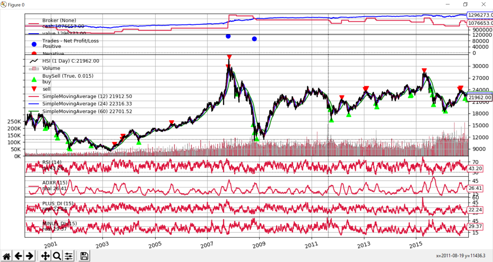

Updated version

Another strategies:(intraday momentum+oscillaor+volume)
https://www.tradingview.com/script/SgHwcRiu-Mixed-strategy-on-intraday-trading-v0-1-beta/

Using backtrader backtesting framework
https://github.com/backtrader/backtrader

Strategies using ADXR and SMA on HSI dayK data(2000-2017)

Final Portfolio Value: 1283816.00
sharperatio:0.17364276275950308
max.drawdown, 4.339916400969328%, max.moneydown, 48861.0

Results be refined with different parameters(period, lotsize, adxr threshold...)
